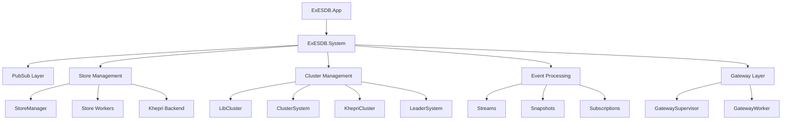
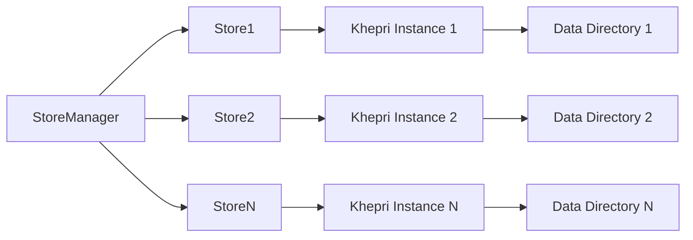
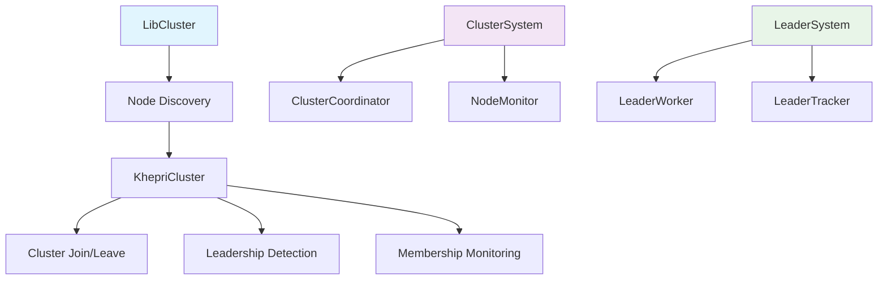
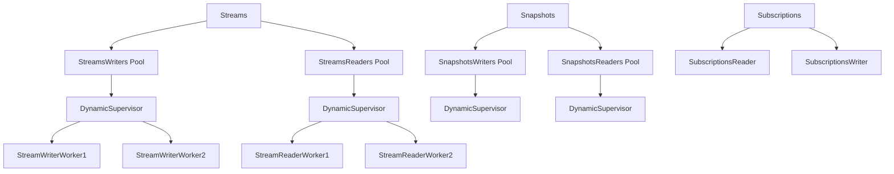
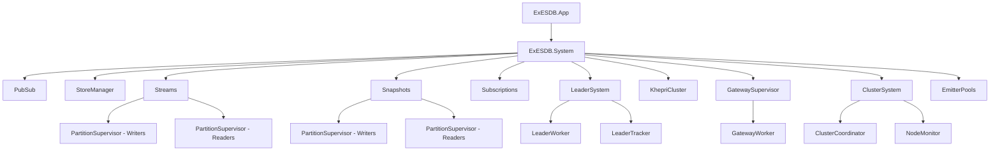
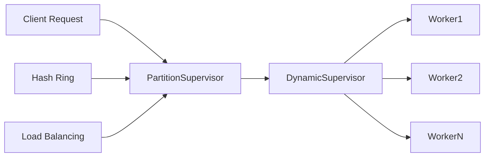
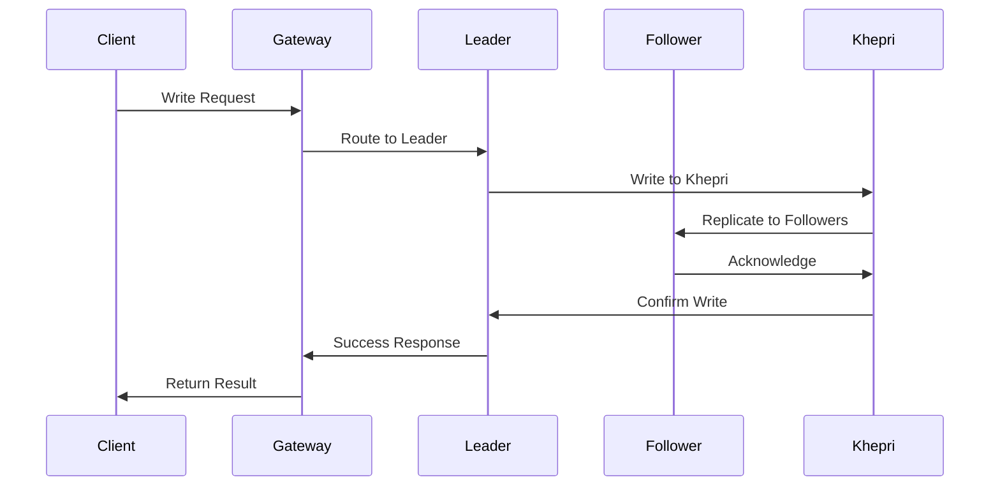
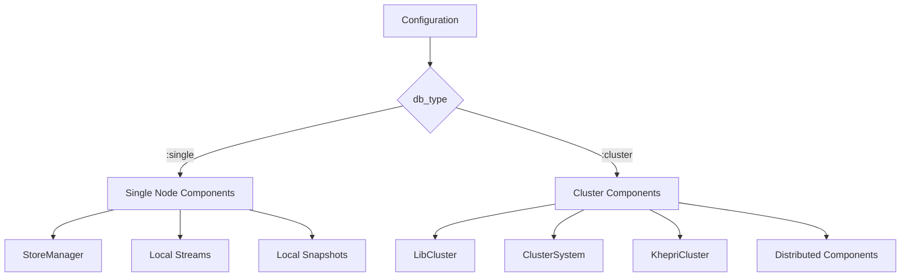
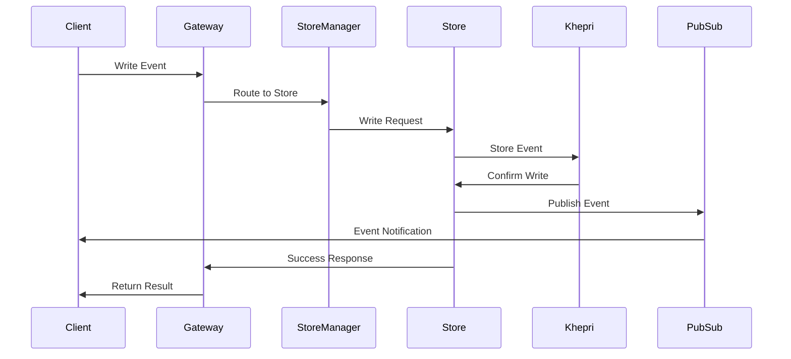
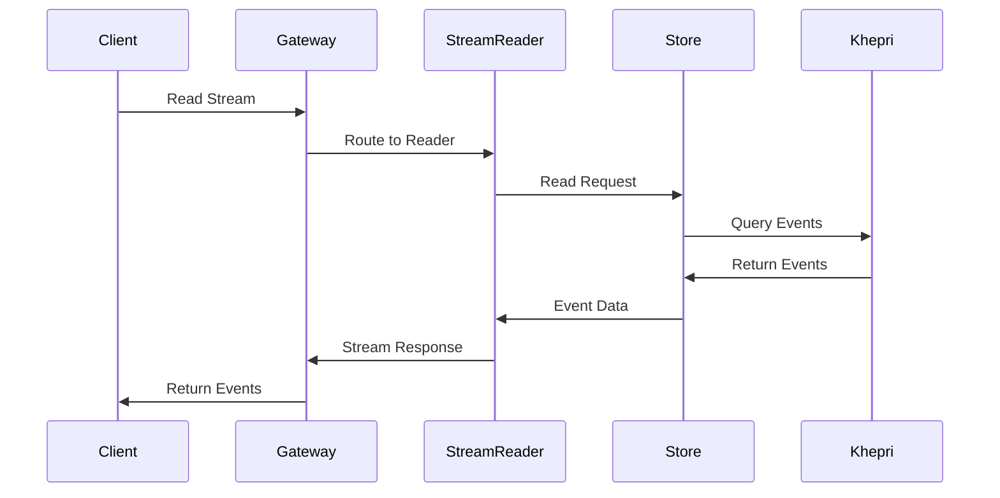

# ExESDB Architecture Analysis

## Overview

ExESDB is a BEAM-native Event Store built on top of the Khepri library, which in turn is built on the Ra library. It's designed as a distributed, fault-tolerant event sourcing system that leverages the strengths of the BEAM ecosystem for handling concurrent, distributed workloads.

## High-Level Architecture

## Core Components

### 1. Application Layer

#### ExESDB.App
- **Purpose**: Main application entry point
- **Responsibilities**:
  - Application lifecycle management
  - Initial configuration loading
  - Starting the main supervisor tree
  - Graceful shutdown handling

#### ExESDB.System
- **Purpose**: Top-level supervisor for the entire system
- **Responsibilities**:
  - Supervises all major subsystems
  - Manages system startup sequence
  - Handles OS signal processing
  - Dynamically configures components based on deployment mode (single vs cluster)

### 2. Storage Layer

#### ExESDB.StoreManager
- **Purpose**: Multi-store management and coordination
- **Responsibilities**:
  - Dynamic store creation and removal
  - Store lifecycle management
  - Configuration management per store
  - Store status tracking

#### ExESDB.Store
- **Purpose**: Individual event store wrapper around Khepri
- **Responsibilities**:
  - Khepri store initialization
  - Store state management
  - Direct interaction with Khepri API

### 3. Clustering Layer

The clustering layer provides distributed coordination and fault tolerance:

#### ExESDB.KhepriCluster
- **Purpose**: Khepri-specific cluster coordination
- **Responsibilities**:
  - Cluster join/leave operations
  - Leadership detection and tracking
  - Membership monitoring
  - Node health monitoring

#### ExESDB.ClusterSystem
- **Purpose**: High-level cluster coordination
- **Responsibilities**:
  - Supervises cluster coordination components
  - Manages cluster-specific services
  - Handles split-brain prevention

#### ExESDB.LeaderSystem
- **Purpose**: Leadership management
- **Responsibilities**:
  - Leader election coordination
  - Leader-specific functionality activation
  - Leader state tracking

### 4. Event Processing Layer

#### ExESDB.Streams
- **Purpose**: Event stream management
- **Responsibilities**:
  - Stream read/write operations
  - Stream partitioning via PartitionSupervisor
  - Worker pool management for stream operations

#### ExESDB.Snapshots
- **Purpose**: Snapshot management for event sourcing
- **Responsibilities**:
  - Snapshot creation and retrieval
  - Snapshot versioning
  - Snapshot storage path management

#### ExESDB.Subscriptions
- **Purpose**: Event subscription management
- **Responsibilities**:
  - Subscription lifecycle management
  - Event delivery to subscribers
  - Subscription persistence

### 5. Communication Layer

#### PubSub Integration
- **Purpose**: Inter-process and inter-node communication
- **Responsibilities**:
  - Event broadcasting
  - Subscription management
  - Message routing

#### ExESDB.GatewaySupervisor & GatewayWorker
- **Purpose**: External API gateway
- **Responsibilities**:
  - External client request handling
  - API endpoint management
  - Request routing to appropriate subsystems

## Architecture Patterns

### 1. Supervision Tree Pattern

### 2. Worker Pool Pattern

ExESDB extensively uses worker pools for different types of operations:

### 3. Distributed State Management

## Deployment Modes

### Single Node Mode
- **Configuration**: `db_type: :single`
- **Characteristics**:
  - No clustering components
  - Local-only operations
  - Simplified architecture
  - Development/testing focused

### Cluster Mode
- **Configuration**: `db_type: :cluster`
- **Characteristics**:
  - Full clustering capabilities
  - Distributed consensus via Ra
  - Fault tolerance
  - Production-ready

## Data Flow

### Event Write Flow

### Event Read Flow

## Key Design Decisions

### 1. Khepri as Backend
- **Rationale**: BEAM-native, Ra-based distributed database
- **Benefits**: 
  - Native Erlang integration
  - Built-in clustering
  - Strong consistency guarantees
  - Fault tolerance

### 2. Supervisor Tree Architecture
- **Rationale**: Leverages OTP supervision principles
- **Benefits**:
  - Fault isolation
  - Automatic restart strategies
  - System resilience
  - Clear responsibility boundaries

### 3. Worker Pool Pattern
- **Rationale**: Efficient concurrent processing
- **Benefits**:
  - Load distribution
  - Resource management
  - Scalability
  - Fault tolerance

### 4. Multi-Store Architecture
- **Rationale**: Support for multiple event stores in single cluster
- **Benefits**:
  - Tenant isolation
  - Resource optimization
  - Flexible deployment
  - Gradual migration support

## Performance Considerations

### Partitioning Strategy
- Uses PartitionSupervisor for distributing workload
- Hash-based routing for even distribution
- Separate pools for read/write operations

### Clustering Optimization
- Configurable probe intervals for node monitoring
- Failure thresholds to prevent cascade failures
- Efficient membership change detection

### Resource Management
- Dynamic worker creation/destruction
- Configurable timeout values
- Memory-efficient event storage via Khepri

## Security Considerations

### Network Security
- Node-to-node communication via Erlang distribution
- Cluster authentication via shared secrets
- Network partitioning detection and handling

### Access Control
- Gateway-based request filtering
- Store-level access control
- Subscription-based permissions

## Monitoring and Observability

### Metrics Collection
- Built-in metrics module
- Performance monitoring
- Cluster health tracking

### Logging Strategy
- Structured logging throughout
- Configurable log levels
- Cluster-aware log correlation

### Health Checks
- Node health monitoring
- Store availability checks
- Leadership status tracking

## Scalability Patterns

### Horizontal Scaling
- Add nodes to existing cluster
- Automatic workload redistribution
- Leader election for coordination

### Vertical Scaling
- Worker pool sizing
- Memory allocation tuning
- Timeout configuration

This architecture provides a solid foundation for building distributed, fault-tolerant event sourcing systems while leveraging the unique strengths of the BEAM ecosystem.
